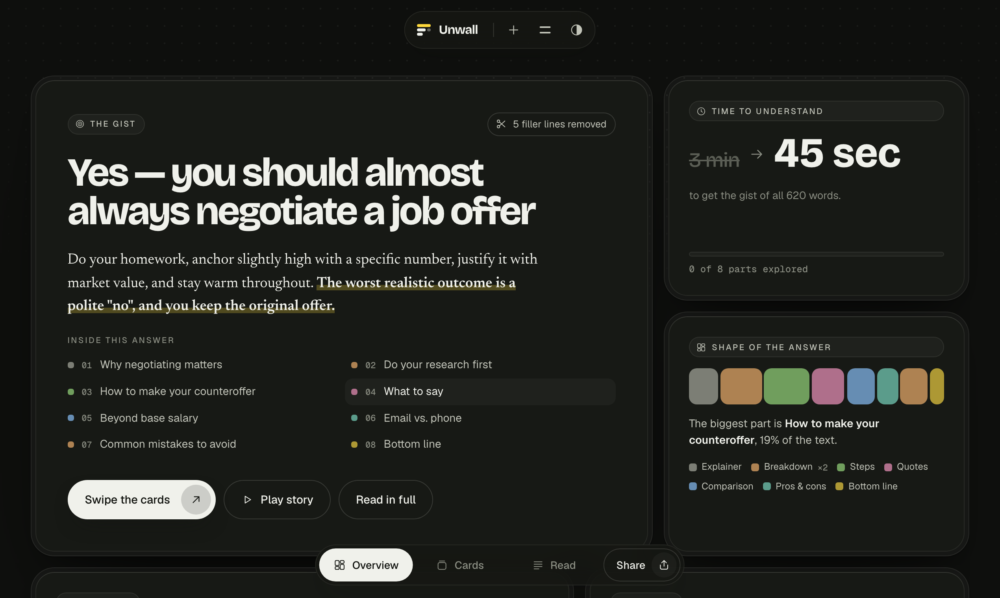
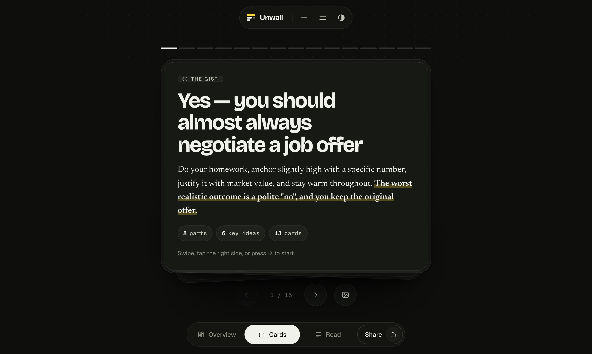
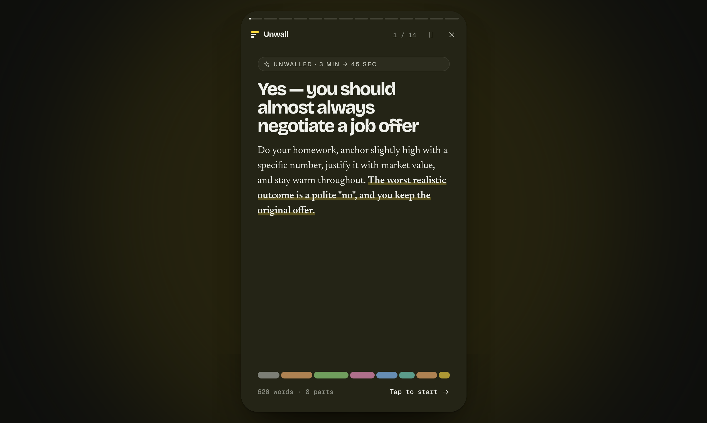

# Unwall

**Paste the wall. Get the gist.**

Unwall turns long answers from ChatGPT, Claude, Gemini and other AI chats into a one-screen overview, swipeable cards and step-by-step checklists. It runs entirely in your browser, has no sign-up, and contains no AI.

**Try it: [unwall.triagic.com](https://unwall.triagic.com)**

[](LICENSE)




## What it does

Paste any AI answer written in Markdown and Unwall gives you four ways to read it:

- **Overview** shows the gist on one screen: a TL;DR, the key ideas, the time it takes to read, and a colour-coded "shape" of the answer.
- **Cards** splits the answer into a swipeable deck with one idea per card.
- **Read** is a skim-friendly long-read with a contents rail. Numbered steps become checklists that remember your progress.
- **Story** is a full-screen, auto-advancing player. Every shared link opens in it.

It also:

- **Removes filler.** Lines like "Great question!" and "I hope this helps!" are dropped, and Unwall tells you how many it removed.
- **Labels each part.** Sections are tagged as an explainer, breakdown, steps, comparison, pros and cons, quotes, code, or bottom line, each with its own highlighter colour.
- **Shares** an answer as a link, a plain-text TL;DR, or a PNG card drawn in the browser.
- **Saves a library** of past answers in your browser, with search, JSON backup and restore, and `.md` import.
- **Grabs answers with a bookmarklet.** Drag it to your bookmarks bar and click it on a chat page. It sends the latest answer, or whatever you've selected, straight to Unwall.

| Cards | Story |
|---|---|
|  |  |

## How it works (and why there's no AI)

Unwall doesn't summarise or rewrite anything. AI chats already answer in Markdown, so Unwall reshapes the structure the answer already has:

1. **Clean up.** Normalise the text and strip filler openers, preambles and sign-offs.
2. **Parse.** Run the [marked](https://marked.js.org) lexer to turn the Markdown into tokens, then split those tokens into sections at the headings.
3. **Classify.** Give each section a kind based on its shape: ordered lists become steps, tables become comparisons, "Pros" and "Cons" labels become pros and cons, and so on.
4. **Extract.** The TL;DR comes from the answer's own summary or opening, cut at whole sentences. The key ideas are the phrases the model chose to put in bold.
5. **Lay out.** Measure the real DOM to fill each card and story slide, so nothing gets cut off mid-thought.

Every word you see comes from the original answer. That makes Unwall instant and deterministic: it can't hallucinate.

## Privacy

- **Answers never leave your device by default.** Parsing and rendering happen in the page. Your library is stored in `localStorage` under `unwall.v1.docs`.
- **Share links carry the answer themselves.** The answer is deflated and stored in the URL `#fragment`, which browsers never send to a server.
- **Optional short links are end-to-end encrypted.** If a host runs the optional short-link store (see below), the browser encrypts the answer with AES-GCM before upload. The key exists only in the link's fragment, so the store holds ciphertext it cannot read.
- **Some third parties are still involved.** The page loads fonts from Google Fonts and libraries from cdnjs and jsDelivr, so those providers see a page request. They never see your text.

## Run it locally

You need [Node.js](https://nodejs.org) 20.11 or later. There's nothing to install.

```bash
git clone https://github.com/tinker20/unwall.git
cd unwall
npm run dev
```

Open http://127.0.0.1:4173. The dev server serves `index.html` and runs the short-link API (`api/s.js`) with an in-memory store, so short links work locally until you stop the server.

### Self-test

Open http://127.0.0.1:4173/#selftest. The app analyses its two built-in examples, checks the results, and shows "Self-test passed" in a toast. The full results table is in the browser console.

## Deploy your own

Unwall is one static file. Put `index.html` on any static host, such as Cloudflare Pages, GitHub Pages, Netlify or Vercel.

Short links are optional. Without them, Unwall falls back to long, self-contained `#d=` links. To turn them on:

1. Deploy to Vercel, which picks up `api/s.js` as a serverless function at `/api/s`.
2. Connect an [Upstash Redis](https://upstash.com) or Vercel KV store. The function reads `KV_REST_API_URL` and `KV_REST_API_TOKEN`, or `UPSTASH_REDIS_REST_URL` and `UPSTASH_REDIS_REST_TOKEN`.

## Project layout

```
index.html        the whole app: markup, styles and script, no build step
api/s.js          optional short-link store (stores only ciphertext)
dev.mjs           local dev server: static files plus /api/s
docs/             README screenshots
```

## Contributing

Bug reports, ideas and pull requests are welcome. The most useful thing you can send is an AI answer that still looks like a wall after you Unwall it. Read [CONTRIBUTING.md](CONTRIBUTING.md) before you open a pull request.

To report a security problem, follow [SECURITY.md](SECURITY.md) instead of opening a public issue.

## Built with

- [marked](https://github.com/markedjs/marked) parses the Markdown.
- [DOMPurify](https://github.com/cure53/DOMPurify) sanitises everything that gets rendered.
- [highlight.js](https://github.com/highlightjs/highlight.js) highlights code.
- [Turndown](https://github.com/mixmark-io/turndown) and [turndown-plugin-gfm](https://github.com/mixmark-io/turndown-plugin-gfm) convert HTML grabbed by the bookmarklet back into Markdown.
- The fonts are [Bricolage Grotesque](https://fonts.google.com/specimen/Bricolage+Grotesque), [Geist](https://vercel.com/font) and [Newsreader](https://fonts.google.com/specimen/Newsreader).

These libraries load from public CDNs at pinned versions and keep their own licenses.

## License

[MIT](LICENSE) © 2026 Sayan Bhattacharya
